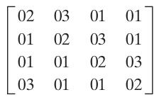

**1.  Qual foi o conjunto original de critérios usados pelo NIST para avaliar as cifras AES candidatas?**

R: O conjunto original de critérios usado pelo NIST (National Institute of Standards and Technology) para avaliar as cifras AES (Advanced Encryption Standard) candidatas era composto por 15 critérios. Esses critérios foram estabelecidos no documento intitulado "Announcement of the Advanced Encryption Standard (AES) Candidate Conference". Os critérios são segurança, algoritmo e implementação do mesmo, implementações independentes, facilidade de uso, flexibilidade, eficiência, portabilidade, viabilidade, análise criptográfica, análise de desempenho, análise de algoritmo, análise de chave, análise de tamanho de bloco, análise de subchaves e análise de resistência de ataques.

**2. Qual foi o conjunto final de critérios usados pelo NIST para avaliar as cifras AES candidatas?**

R: O conjunto final de critérios estabelecidos pelo NIST foram (1)implementar criptografia de chave simétrica (secreta), (2) ser uma cifra de bloco e (3) suportar tamanhos de chave criptográfica variável de 128 bits, 192 bits e 256 bits com um tamanho de bloco de 128 bits. 
Além disso o NIST pediu especificações escritas completas do algoritmo, declarações da eficiência computacional estimada do algoritmo, valores de teste de resposta conhecidos para o algoritmo e código para gerar esses valores, declaração da força criptográfica esperada do algoritmo, análise de o algoritmo com relação a ataques conhecidos, declaração de vantagens e limitações do algoritmo, implementação de referência do algoritmo (especificada em ANSI C), implementações otimizadas especificadas em Java e em ANSI C e declarações assinadas de que a) identificaram quaisquer patentes e pedidos de patente pertinentes e b) forneceram o uso isento de royalties dessa propriedade intelectual caso o candidato selecionado fosse selecionado para inclusão no AES.

**3. Qual é a diferença entre Rijndael e AES?**

R: Rijndael é uma família de cifras com diferentes tamanhos de chave e bloco. Já o AES é um padrão estabelecido pelo NIST que segue um serie de critérios para um algoritmo ser classificado como um Advanced Encryption Standard. Que para a conferência realizada foram escolhidos três algoritmos como AES sendo o Rijndael de blocos de 128, 192 e 256 bits.

**4. Responda**
**a. Qual a finalidade do array Estado?**

R: O array de estado contém as palavras em bytes do texto cifrado até a rodada final.

**b. Como é a estrutura da S-box?**

R: A S-box é formada pensando em sua consulta, onde a primeira linha é enumerada na forma {00}, {01}, {02}, …, {0F}. A segunda é formada {10}, {11}, {12}, … {1F}. E as linhas seguintes são formadas de maneira sequencial para consulta a posteriori até a célula {FF}. Em seguida é aplicado o inverso multiplicativo no Corpo finito GF(28) a cada célula da tabela e a fórmula abaixo é aplicada a cada inverso gerado. 

b'i = bi + b(i + 4) mod 8 + b(i + 5) mod 8 + b(i + 6) mod 8 + b(i + 7) mod 8  + ci

Onde ci é o bit *i* do binário 01100011 para gerar a S-box.

**c. Descreva rapidamente o estágio SubBytes, ShiftRows, MixColumns, AddRoundKey, e o algoritmo de expansão de chave.**

SubBytes é a operação realizada identificando o elemento que corresponde à palavra atual {*IJ*} do array Estado na célula da S-box na linha *I* e coluna *J*. 
ShiftRows é a operação que realiza *n* shifts a esquerda nas linhas do array Estado. Onde *n* é o número da linha começando do 0, ou seja, linha 0 realiza 0 shifts, linha 1 realiza 1 shift, etc.
MixColumns é a operação que realiza uma multiplicação do array Estado com a matriz abaixo. Tal multiplicação matricial realiza operações de shift e XOR como soma dentro de GF(28).

AddRoundKey é a operação que realiza um XOR com a chave da rodada

**5. Quantos bytes no Estado são afetados por ShiftRows?**

R: 12 bytes já que os shifts realizados deslocam os bytes pelo menos uma vez no Estado.

**7. Compare AES com DES. Para cada um dos seguintes elementos do DES, indique o elemento comparável no AES ou explique por que ele não é necessário no AES.**
**a. XOR do material da subchave com a entrada da função f.**

R: No AES, essa operação não é necessária, pois as subchaves são geradas de forma independente  para cada rodada do algoritmo. O AES possui um esquema de programação de chaves mais seguro e flexível, onde as subchaves são geradas a partir de uma chave mestra usando um algoritmo específico. Portanto, não há necessidade de fazer um XOR separado com o material da subchave no AES.

**b. XOR da saída da função f com a metade esquerda do bloco.**

R: No DES, a saída da função f é combinada com a metade esquerda do bloco usando a operação de XOR. Essa operação é necessária para a mistura de dados no DES e ajuda a garantir a confusão e difusão necessárias para a segurança do algoritmo. No AES, essa operação não é realizada explicitamente. Em vez disso, o AES utiliza uma combinação de substituições não-lineares (SubBytes), permutações (ShiftRows) e misturas de colunas (MixColumns) em suas etapas de transformação. Essas etapas fornecem a confusão e difusão necessárias sem a necessidade de um XOR separado com a metade esquerda do bloco.

**c. função f.**

R: A função f no DES é uma função complexa que inclui permutações, substituições e operações de XOR. Ela opera em uma metade do bloco de dados e usa uma subchave específica para essa rodada. No AES, a função análoga à função f é chamada de "SubBytes" e "MixColumns". Essas etapas realizam substituições não-lineares e misturas de colunas, respectivamente, em todos os bytes do bloco, em vez de operar em metades separadas do bloco. Portanto, não há uma função f direta no AES, mas sim uma combinação de etapas que fornecem confusão e difusão em todo o bloco.

**d. permutação P.**

R: No DES, a permutação P é aplicada após a função f e reorganiza os bits do bloco de acordo com uma tabela de permutação fixa. Essa permutação tem o objetivo de melhorar a difusão dos bits no bloco. No AES, não há uma permutação P específica. A difusão dos bits é alcançada por meio das etapas de substituições e misturas mencionadas anteriormente, que são aplicadas em cada rodada. Essas etapas garantem a dispersão dos bits em todo o bloco de maneira mais eficiente do que uma permutação fixa.

**e. roca de metades do bloco.**

R: No DES, ocorre uma troca da metade esquerda e direita do bloco após cada rodada. Essa troca é necessária para garantir que as operações sejam aplicadas alternadamente às metades do bloco. No AES, não há uma troca explícita de metade do bloco como no DES. O AES opera em todo o bloco de uma só vez, sem a necessidade de dividir em metades. As etapas de substituições, permutações e misturas são aplicadas em todos os bytes do bloco simultaneamente, garantindo uma difusão adequada e confusão dos dados.
