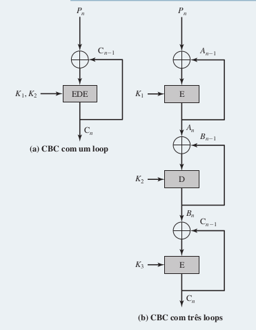

**1. O que é encriptação tripla?**

R: É uma encriptação ou cifragem que possui três estágios de encriptação, como o triple DES utilizando três chaves diferentes. O primeiro estágio é passada a chave em cima do texto, resultando em um C*1* onde *1* é o estágio de encriptação. Em seguida é passada uma segunda chave em C*1*, resultando em C*2* e por último é passado uma terceira chave em C*2* resultando em um C*3*. Por fim, C*3* é o texto cifrado final.

**2. O que é ataque *meet-in-the-middle*?**

R: É o ataque suposto que quebra a dupla incriptação do DES de maneira relativamente simples. Dado um par conhecido de palavra e texto cifrado, (*P*, *C*), o ataque prossegue da forma a seguir. Primeiro, encripte *P* para todos os 256 valores possíveis de K*1*. Armazene esses resultados em uma tabela e depois ordene-a pelos valores de X. Em seguida, decripte C usando todos os 256 valores possíveis de K*2*. À medida que cada decriptação é produzida, compare o resultado com a tabela, em busca de uma ocorrência. Se houver uma correspondência, então confronte as duas chaves resultantes com um novo par de texto claro/texto cifrado conhecido. Se as duas chaves produzirem o texto cifrado esperado, aceite-as como as corretas.

**3. Quantas chaves são usadas na encriptação tripla?**

R: Dependendo da implementação do *TRIPLE DES* podesse utilizar duas ou três chaves. Caso seja utilizada duas chaves é feita uma decriptação com a segunda chave no segundo estágio de encriptação. Já se utilizada três chaves é utilizada uma chave para cada estágio de encriptação.

**4. Por que a parte do meio do 3DES é decriptação, em vez de encriptação?**

R: Pelo motivo que o altoritmo do *3DES* com três chaves exige um tamanho de chave de 2168 o que é consideravelmente pesado. Dessa forma, foi proposta a solução por Tuchman de utilizar somente duas chaves e realizar uma sequência de encriptar-decriptar-encriptar, onde se utiliza chave-1_chave-2_chave-1 respectivamente.

**5. Por que alguns modos de operação de cifra de bloco só utilizam a encriptação, enquanto outros empregam encriptação e decriptação?**

R: É resultado da simetria entre a encriptação e decriptação do modo de cifra. Enquanto alguns possibilitam a mesma estrutura de encriptação e decriptação, isto é, se alteram apenas os parâmetros que passam pelo altoritmo outros modos não possuem essa caracteristica, fazendo-se necessária uma nova implementação para a decriptação.

**6. Você deseja construir um dispositivo de hardware para realizar encriptação de bloco no modo cipher block chaining (CBC) usando um algoritmo mais forte do que DES. 3DES é um bom candidato. A Figura 1 mostra duas possibilidades, ambas acompanhando a definição do CBC. Qual das duas você escolheria:**

**a. Por segurança?**

R: Certamente a estrutura *b* seria mais segura pois são utilizadas 3 sequências de encriptar-decriptar-encriptar, ou seja, encriptar-encriptar-encriptar-decriptar-decriptar-decriptar-encriptar-encriptar-encriptar, onde cada sequência de três utilizando um chave diferente.

**b. Por desempenho?**

R: Aqui seria a estrutura *a* pois são realizadas apenas três operações no lugar de nove que são realizadas na estrutura *b*.  